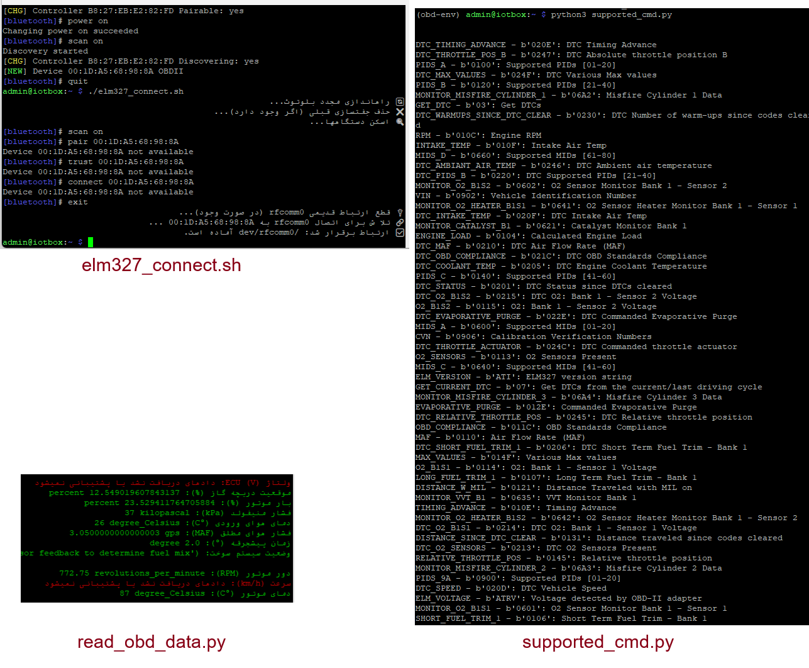

# ELM327 Vehicle Data via python-OBD

ELM327 OBD-II Raspberry Pi Project – Overview & Setup

🚗 Project Overview

This project shows how to connect a Raspberry Pi (or any Linux-based system) to a vehicle’s OBD-II port using an ELM327 adapter (Bluetooth-based, using the BCM43430A1 chip). It enables reading live vehicle data like RPM, speed, coolant temperature, throttle position, etc., via Python and the python-OBD library.

🔧 Step-by-Step Setup

1. 🔌 Install required packages:

sudo apt-get install bluetooth bluez blueman python3-serial

2. 🔁 Pair your ELM327 (first time only):

bluetoothctl

power on

agent on

default-agent

scan on

🕐 After 30–60 seconds, your device should appear (e.g., 00:1D:A5:68:98:8A). Then:

remove 00:1D:A5:68:98:8A

pair 00:1D:A5:68:98:8A

trust 00:1D:A5:68:98:8A

connect 00:1D:A5:68:98:8A

quit

3. 🔗 Bind ELM327 to serial port:

sudo rfcomm bind rfcomm0 00:1D:A5:68:98:8A

Or just use the helper script:

./elm327_connect.sh

4. 🔄 Reset Bluetooth if needed:

sudo systemctl restart bluetooth

sudo service bluetooth restart

bluetoothctl

power off

power on

If still stuck:

ps aux | grep bluetooth

sudo kill -9 <PID>

sudo systemctl restart bluetooth

Then repeat pairing.

5. 🔋 Important Notes:

    Turn the vehicle ignition to ON (ACC mode).

    Replug the ELM327 adapter before scanning.

    Wait 20–40 seconds after ignition before running scripts.

🐍 Run Python environment:

source ~/obd-env/bin/activate

pip install colorama

python3 read_obd_data.py

🧰 Use Cases

    Real-time vehicle diagnostics

    Monitor RPM, temperature, voltage

    Build digital car dashboards with Raspberry Pi

    Automotive learning & prototyping

    Remote fleet diagnostics

✅ Compatible with most OBD-II vehicles after 2001 (EU) / 1996 (US).

🇩🇪 ELM327 OBD-II Raspberry Pi Projekt – Übersicht & Einrichtung

🚗 Projektübersicht

Dieses Projekt zeigt, wie man ein Raspberry Pi mit einem Fahrzeug über einen ELM327 Bluetooth-Adapter (BCM43430A1) und die OBD-II-Schnittstelle verbindet. Damit können Live-Fahrzeugdaten wie Drehzahl, Geschwindigkeit, Kühlmitteltemperatur, Drosselklappenstellung usw. mit Python und der python-OBD-Bibliothek ausgelesen werden.
🔧 Schritt-für-Schritt Einrichtung

1. ❗ Notwendige Pakete installieren:

sudo apt-get install bluetooth bluez blueman python3-serial

2. 📶 ELM327 zum ersten Mal koppeln:

bluetoothctl

power on

agent on

default-agent

scan on

🕐 Nach 30–60 Sekunden erscheint dein Gerät (z. B. 00:1D:A5:68:98:8A):

remove 00:1D:A5:68:98:8A

pair 00:1D:A5:68:98:8A

trust 00:1D:A5:68:98:8A

connect 00:1D:A5:68:98:8A

quit

3. 🔗 Mit serieller Schnittstelle verbinden:

sudo rfcomm bind rfcomm0 00:1D:A5:68:98:8A

Oder einfach:

./elm327_connect.sh

4. 🔁 Bluetooth zurücksetzen (falls nötig):

sudo systemctl restart bluetooth

sudo service bluetooth restart

bluetoothctl

power off

power on

Falls weiterhin keine Verbindung:

ps aux | grep bluetooth

sudo kill -9 <PID>

sudo systemctl restart bluetooth

Dann erneut koppeln.

5. ❗ Wichtig:

    Zündung des Fahrzeugs auf ON / ACC stellen.

    Adapter einmal abziehen und erneut einstecken.

    Warte 20–40 Sekunden nach dem Einschalten, bevor du weiterarbeitest.

✅ Kompatibel mit den meisten OBD-II-Fahrzeugen ab Baujahr 2001 (EU) bzw. 1996 (USA).
## 🔌 Supported OBD-II Parameters (Based on Your Vehicle)

| Parameter Name            | OBD-II PID | Description                          |
|--------------------------|------------|--------------------------------------|
| RPM                      | 010C       | Engine Revolutions Per Minute        |
| SPEED                    | 010D       | Vehicle Speed (km/h)                 |
| COOLANT_TEMP             | 0105       | Engine Coolant Temperature (°C)      |
| THROTTLE_POS             | 0111       | Throttle Position (%)                |
| INTAKE_PRESSURE          | 010B       | Intake Manifold Pressure (kPa)       |
| INTAKE_TEMP              | 010F       | Intake Air Temperature (°C)          |
| MAF                      | 0110       | Mass Air Flow Rate                   |
| TIMING_ADVANCE           | 010E       | Ignition Timing Advance              |
| FUEL_STATUS              | 0103       | Current Fuel System Status           |
| CONTROL_MODULE_VOLTAGE   | 0142       | ECU Voltage Supply (V)               |

> ✅ These are supported on your Mazda when ignition is ON.

## 🛠 Usage Instructions

1. Run `elm327_connect.sh` to bind the ELM327 to `/dev/rfcomm0`
2. Run `python3 supported_cmd.py` to view available PIDs
3. Run `python3 read_obd_data.py` to start real-time monitoring

