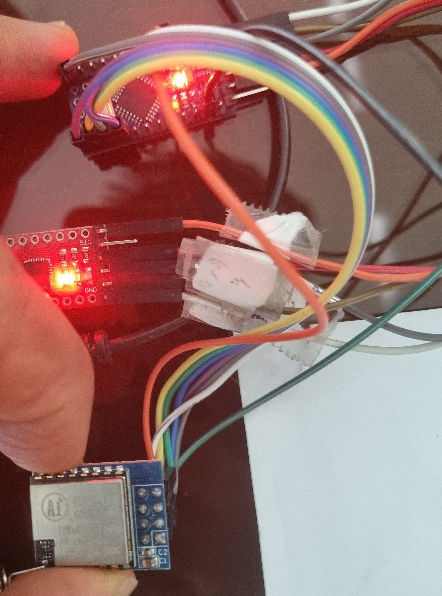
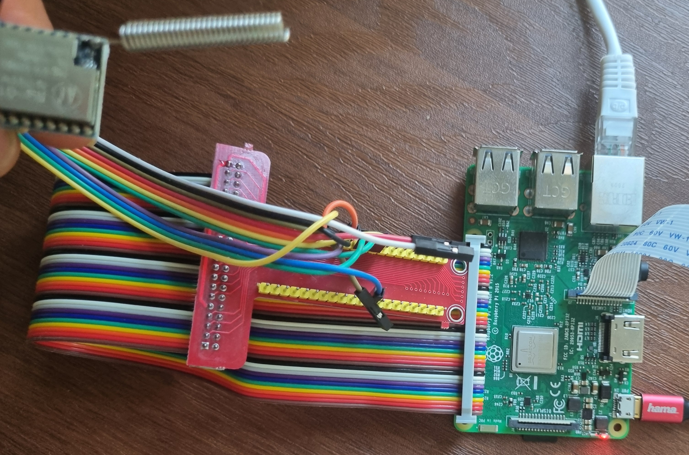
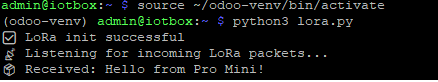

# LoRa Communication Between Arduino Pro Mini and Raspberry Pi 3

This project demonstrates wireless communication between an Arduino Pro Mini (using SX1278/LoRa module) and a Raspberry Pi 3 using LoRa (433 MHz).

## 📡 Hardware

### Sender - Arduino Pro Mini + LoRa (SX1278)

| LoRa Pin | Arduino Pro Mini |
|----------|------------------|
| VCC      | 3.3V             |
| GND      | GND              |
| TXD      | D2 (Software RX) |
| RXD      | D3 (Software TX) |
| M0       | GND              |
| M1       | GND              |
| MOSI     | D11              |
| MISO     | D12              |
| SCK      | D13              |
| NSS (CS) | D10              |
| RESET    | D9               |
| DIO0     | D2               |

### Receiver - Raspberry Pi 3 + LoRa (SX1278)

| LoRa Pin | Raspberry Pi 3  | Physical Pin |
|----------|------------------|--------------|
| VCC      | 3.3V             | Pin 1        |
| GND      | GND              | Pin 6        |
| TXD      | GPIO15 (RX)      | Pin 10       |
| RXD      | GPIO14 (TX)      | Pin 8        |
| MOSI     | GPIO10           | Pin 19       |
| MISO     | GPIO9            | Pin 21       |
| SCK      | GPIO11           | Pin 23       |
| NSS      | GPIO8 (CE0)      | Pin 24       |
| RESET    | GPIO25           | Pin 22       |
| DIO0     | GPIO4            | Pin 7        |

## 🛠️ Installation

```bash
pip install raspi-lora
```

## ▶️ Running the Code

Activate your virtual environment if necessary:

```bash
source ~/odoo-venv/bin/activate
```

Then run the script:

```bash
python3 lora_receiver_pi3.py
```

---

## 📤 Arduino Sender Code

```cpp
#include <SPI.h>
#include <LoRa.h>

#define LORA_SS    10
#define LORA_RST   9
#define LORA_DIO0  2

void setup() {
  Serial.begin(9600);
  while (!Serial);

  LoRa.setPins(LORA_SS, LORA_RST, LORA_DIO0);

  if (!LoRa.begin(433E6)) {
    Serial.println("LoRa init failed. Check your connections.");
    while (true);
  }

  Serial.println("LoRa init successful!");
}

void loop() {
  Serial.println("Sending packet...");
  LoRa.beginPacket();
  LoRa.print("Hello from Pro Mini!");
  LoRa.endPacket();
  delay(5000);
}
```


---

## 📷 Wiring Diagrams

**LoRa to Arduino Pro Mini:**  


**LoRa to Raspberry Pi 3:**  


**Sending Example:**  

