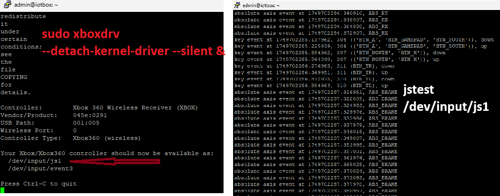

# Raspberry Pi Xbox Controller Snake Game on SSD1306 OLED 🐍🎮

Projektübersicht

Dieses Projekt zeigt, wie ein Raspberry Pi mit einem Xbox 360 Wireless Controller und einem SSD1306 OLED-Display verbunden werden kann, um das klassische Snake-Spiel darzustellen.

🔧 Funktionen:
- Steuerung über Xbox 360 Gamepad
- Anzeige auf einem OLED-Bildschirm (I2C)
- Start-Taste für Pause/Fortsetzen
- Anzeige von Punktestand und Leben
- Ideal für Schulprojekte, Robotik oder Mini-Spiele

📷 Siehe Schaltplan und Spielanzeige unten!

This project demonstrates how to use an Xbox 360 Wireless Controller with a Raspberry Pi to control a classic Snake game displayed on a 128x64 SSD1306 OLED via I2C.
## 📦 Features

- Real-time gameplay on SSD1306 OLED display.
- Xbox 360 Wireless Controller support via `xboxdrv` and `evdev`.
- 5 lives system, food growing logic.
- Start button for pause/resume.
- Non-blocking input handling.

## 🛠 Hardware Requirements

- Raspberry Pi 3/4 with Raspbian
- Xbox 360 Wireless Controller + PC Wireless Gaming Receiver (Vendor ID: `045e:0291`)
- SSD1306 OLED Display (I2C - 128x64)
- Optional: OLED breadboard/jumpers

## 🔌 Wiring OLED (I2C)

| OLED Pin | Raspberry Pi GPIO |
|----------|-------------------|
| VCC      | 3.3V              |
| GND      | GND               |
| SCL      | GPIO 3 (SCL)      |
| SDA      | GPIO 2 (SDA)      |

## 💻 Software Installation

```bash
sudo apt-get update
sudo apt-get install -y bluetooth bluez blueman python3-dev python3-pip python3-serial libfreetype6-dev libjpeg-dev build-essential
pip install luma.oled evdev inputs
```

### Xboxdrv setup

```bash
sudo rmmod xpad
sudo xboxdrv --silent --detach-kernel-driver &
```

## 🎮 Test Controller Input

```python
from inputs import get_gamepad

print("🎮 Waiting for Xbox 360 controller input...\n(Press Ctrl+C to quit)")

try:
    while True:
        events = get_gamepad()
        for event in events:
            if event.ev_type == "Key" and event.state == 1:
                print(f"🔘 Button Pressed: {event.code}")
            elif event.ev_type == "Absolute":
                print(f"🎮 Movement: {event.code} = {event.state}")
except KeyboardInterrupt:
    print("\n🛑 Exit.")
```

## 🕹 Play Snake!

Run the game:

```bash
python3 snake_oled.py
```

Controls:
- D-Pad → Move
- Start → Pause/Resume



## 💡 Industrial Ideas and Projects

| Application                        | Description |
|------------------------------------|-------------|
| 🚒 Firefighting Robots             | Controller input to move a robot with OLED-based stats. |
| 🚁 Drone Control Interface         | Use gamepad to control drones; OLED shows telemetry. |
| 🚗 Vehicle Diagnostic Tool         | Add OBD-II reader to show real-time engine data on OLED. |
| 🛰️ Remote Rover/Camera Movement    | Xbox controller to operate motors and servos. |
| 🚘 Car diagnostics                 | Extend with OBD-II adapter for RPM, temp display |
| 🛰️ Rover navigation                | Xbox pad to control and read sensors |
| 📚 Educational tool                | Teach Python, GPIO, and game logic |

